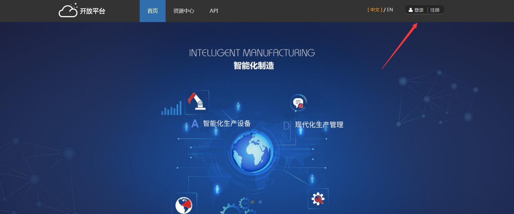
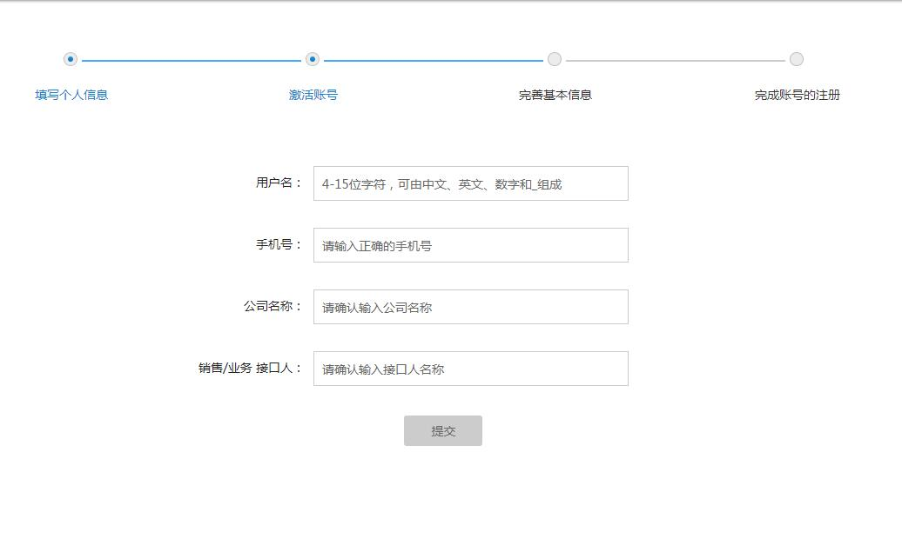
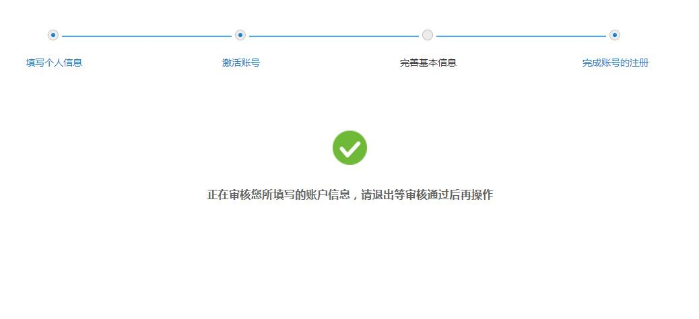
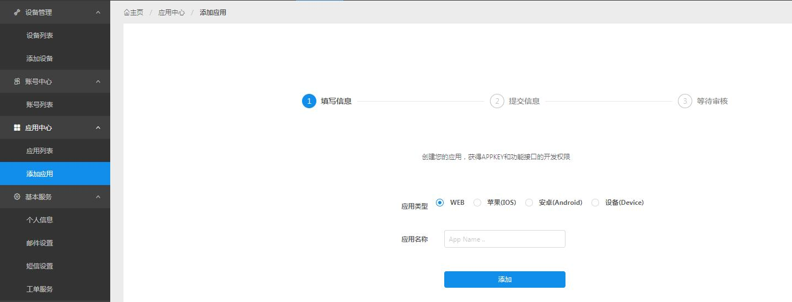
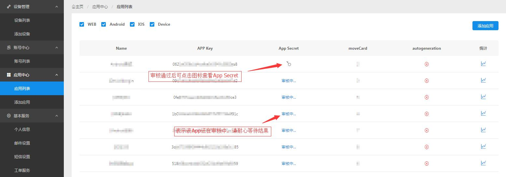

## 入驻成开发者

要使用开放平台任何设施首先要成为开放平台开发者。打开<a href="http://open.xmeye.net/zh/">开放平台首页</a>，点击右上角的<a href="https://open.xmeye.net/register.do">注册</a>以完成开发者入驻。

## 完善资料

必须先完善开发者资料，比如联系方式公司┉┉这是审核应用的前提。完善资料后请耐心等待后台人员审批通过，通过后方可进入控制台。

## 添加应用app

完善信息后，可以直接在控制台-创建应用页面中创建应用，对此推荐针对不同平台申请不同的证书，比如：为移动平台中的 Android 平台和 iOS 平台单独添加应用。

## 等待审核

应用创建之后，需要管理员审核之后才可正常接入使用，请耐心等待。

审核时可以进入 “控制台 － 应用中心 － 应用列表 ”中查看AppKey和movedCard。

审核通过后进入 “控制台 － 应用中心 － 应用列表 ”中查看AppSecret。

**
Action：如果是集成过旧SDK的老客户，在入驻平台之后，联系业务人员或者客服，将uuid切换成老的值，以保证之前注册的用户信息都可以导入到新的系统中来。
**

## 开始与测试

如何正确的调用API查阅
如何使用官方SDK进行开发查阅  
什么叫用户授权查阅  
使用沙箱环境进行测试查阅  

