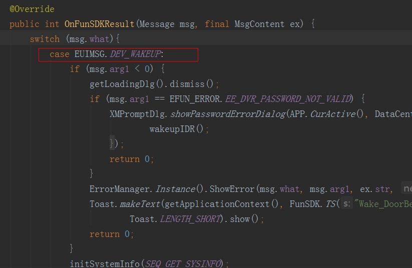

## FunSDK开发常见问题汇总

<label style="color:#c30"><b> Q： 什么是APP证书？</b></label> 
A： 雄迈云APP证书是指在<a href="http://open.xmeye.net/zh/">雄迈开放平台</a>申请注册应用时，由平台统一发放的平台接入证书；包括uuid／App Key／App Secret／moveCard四个部分；其中uuid是客户唯一标识，App Key是App唯一标识，App Secret和moveCard是内容保护所使用的；APP证书是访问平台的合法性依据，为了平台和用户的安全，尽量不要外泄或供第三发使用；我司保留废除被非法使用的证书的权利。
  
<label style="color:#c30"><b> Q： 新版本FunSDK是否只支持注册用户使用？</b></label> 
A： 当前的FunSDK版本，除了注册用户使用之外，仍然保留了本地登录的功能，可以通过设备号/设备登录名/设备登录密码直接登录设备；请参考：<a href="https://open.xmeye.net/resource.do?cid=f4474a6f37f94714b23c8207b8fb3bd8&rid=1936700ca20347d78f2b688bdd127aff">Android集成</a>-><a href="https://open.xmeye.net/resource.do?cid=f4474a6f37f94714b23c8207b8fb3bd8&rid=1936700ca20347d78f2b688bdd127aff#2.2">2.2 几种常见的设备访问方式</a>；但是设备报警功能必须要先注册用户，本平台只对注册用户提供报警功能。
  
<label style="color:#c30"><b> Q：  为什么强烈推荐使用本平台的用户系统？</b></label> 
A： 虽然新的版本依然保持了在无用户登录情况下的设备直接登录，但是还是建议使用在本平台注册用户，因为部分新功能还是需要用户支持的：服务器设备报警推送、DSS转发等。
  
<label style="color:#c30"><b> Q： 为什么查询设备状态失败？</b></label> 
A： 首先确认手机网络连接是否正常；再次确认是否根据设备方式进行了正确的初始化，如果是本地模式直接通过序列号查询设备状态，确保<label style="color:#000044;"><b>FunSDK.SysInitLocal()</b></label>已经被执行，如果是用户模式，确保<label style="color:#000044;"><b>FunSDK.SysInitNet()</b></label>已经被执行，并且ServerIP是可用的；
  
<label style="color:#c30"><b> Q： 用户无法登陆，用户注册失败，用户相关接口都无法使用？</b></label> 
A： 确认<label style="color:#000044;"><b>FunSDK.XMCloudPlatformInit(uuid, AppKey, AppSecret, moveCard)</b></label>已经被正确调用，同时确认APP证书的正确性。
  
<label style="color:#c30"><b>Q： 设备断电后，设备列表中设备状态仍然为在线状态，如何处理？</b></label> 
A： 设备断电后，如果在3分钟内状态设备状态更新为“离线”，为正常情况；如果超出3分钟仍然显示为在线状态，请确认APP已经及时刷新设备状态，如果已经刷新了设备列表/设备状态，仍然显示为在线状态，还请及时联系业务员或客服人员。
  

## 低功耗产品唤醒接口说明

  
门铃等设备唤醒接口: 

``
public static native int DevWakeUp(int hUser, String szDevId, int nSeq);
    hUser:回调ID
    szDevId：设备序列号
    nSeq:默认传0即可
``
  
需要唤醒设备的时候直接调用: 
``
FunSDK.DevWakeUp(GetId(), GetCurDevId(), 0);
``
  
然后在回调函数中再去登录设备或者打开视频操作: 

  
``
msg.arg1 >= 0的时候 表示唤醒成功，然后可以登录、打开视频操作了
msg.arg1 < 0的时候 表示唤醒失败
``
  
让设备休眠的时候直接登出设备即可: 
``
FunSDK.DevLogout(this.GetId(),GetCurDevId(), 0);
``
  
<label style="color:#c30">注：设备是在没有任何客户端连接的情况下会自动休眠</label>
