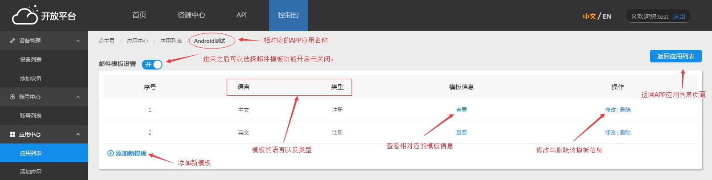
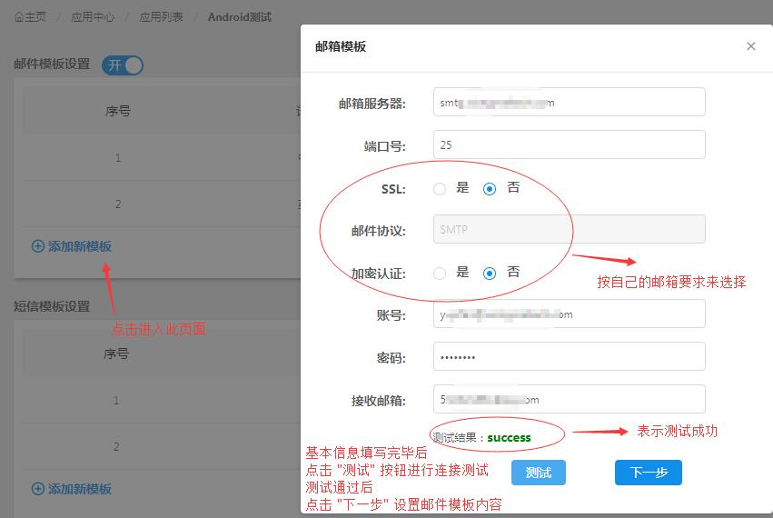
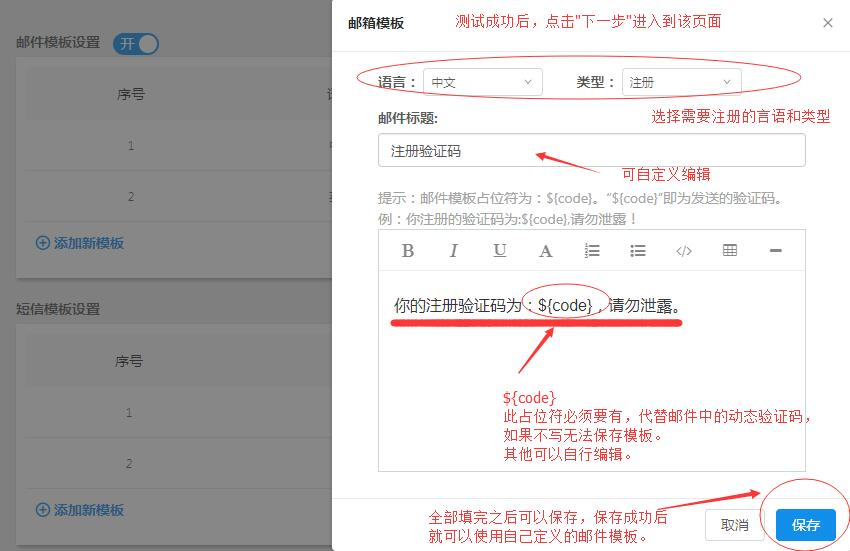

## 邮件模板设置步骤

1、邮件模板设置入口：

2、进入邮件模板页面后基础操作：

3、添加新的邮件模板，需测试成功后才能保存：

4、测试成功后进入下一步，填写模板信息。必须包含占位符"${code}"：

## 邮件模板常见问题

### 不同APP应用能否使用不同的邮箱信息以及邮件模板？
答：不同APP应用可以使用不同的邮箱信息以及邮件模板。
    只需要在应用列表主页面，点击相应APP应用的设置按钮，进入邮件模板进行设置即可。