## 短信模板设置步骤

1、短信模板设置入口：
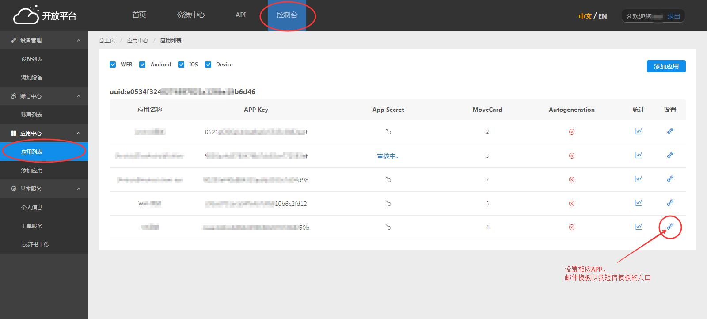

2、添加新的短信模板，需测试成功后才能保存：
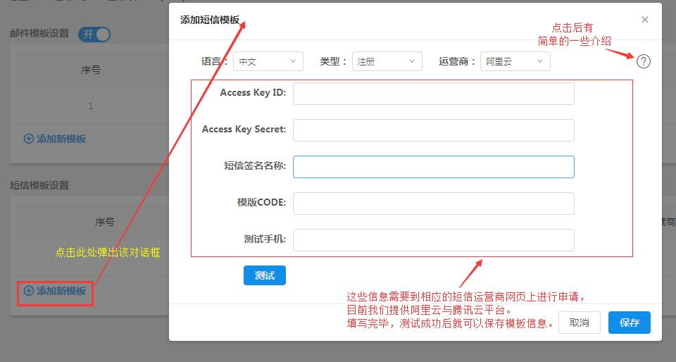

## 短信模板常见问题

### 短信模板支持哪些平台？
答：我们目前支持
    1、[阿里云平台短信服务](https://www.aliyun.com/product/sms)

    2、[腾讯云平台短信服务](https://cloud.tencent.com/product/sms)

    3、[华为云平台短信服务](https://www.huaweicloud.com/product/msgsms.html)

#### 阿里云平台

1、进入网站登录，找到短信服务：
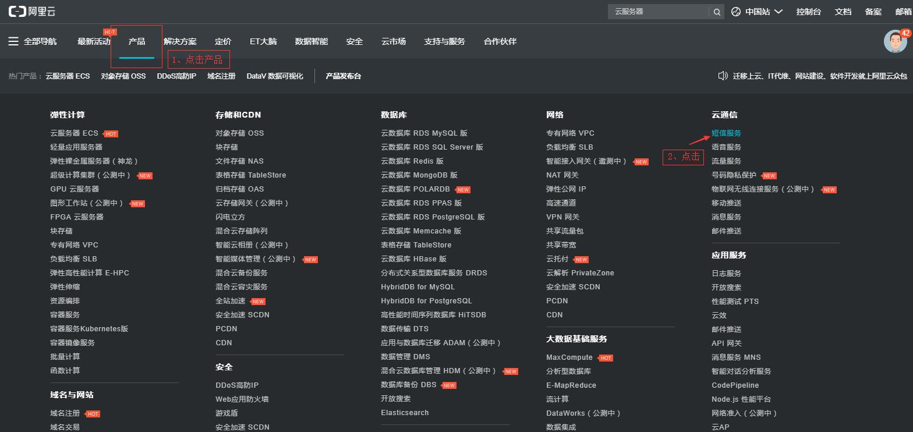

2、进入控制台：
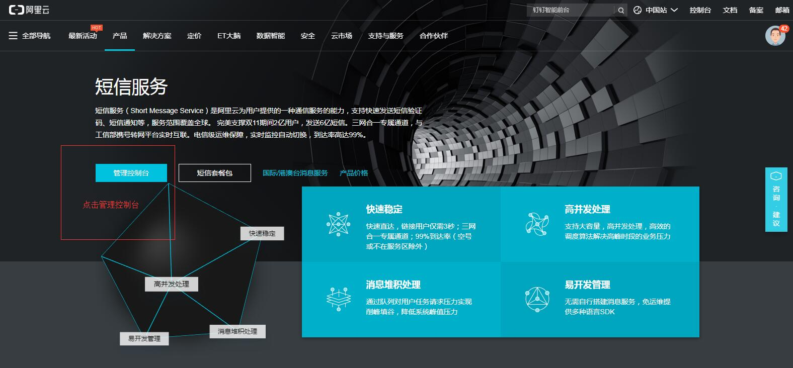

3、点击接口调用，第一次使用时需创建AccessKey，创建一次后，后期无需再次创建，只需要查看：
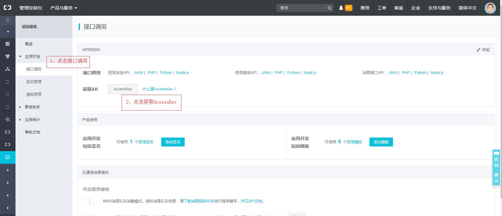

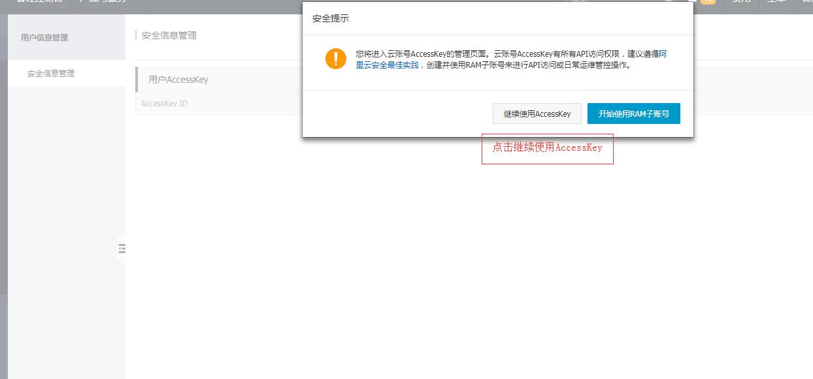

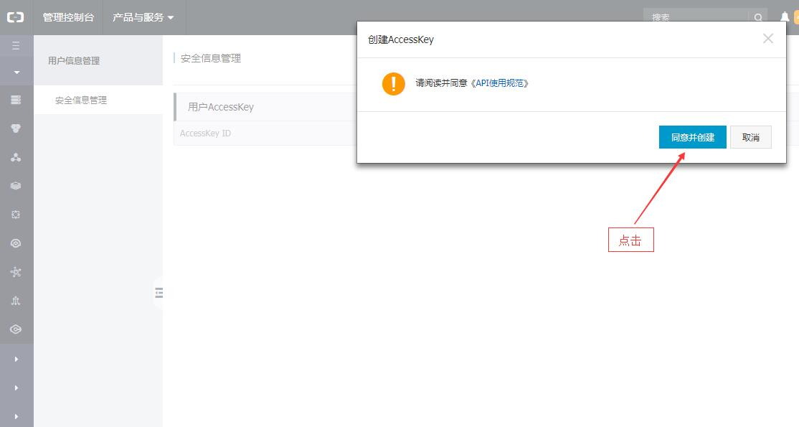

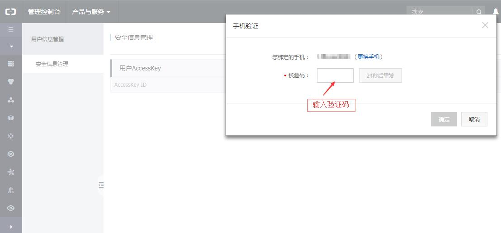

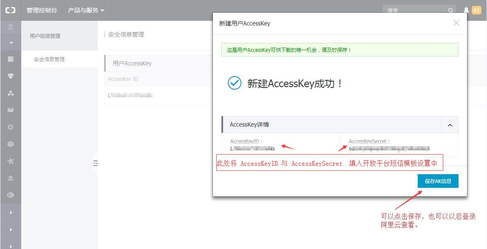

4、设置签名：
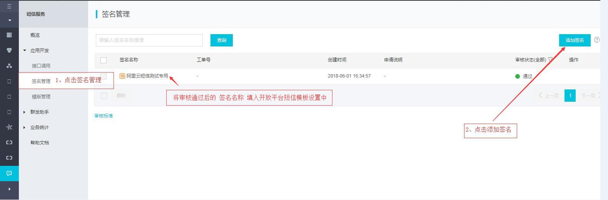

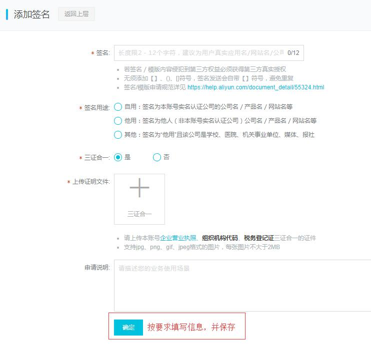

5、设置模板：

<label style="color:#c30">注册短信模板和找回密码的绑定模板都需要设置。至少要设置两个模板。</label>

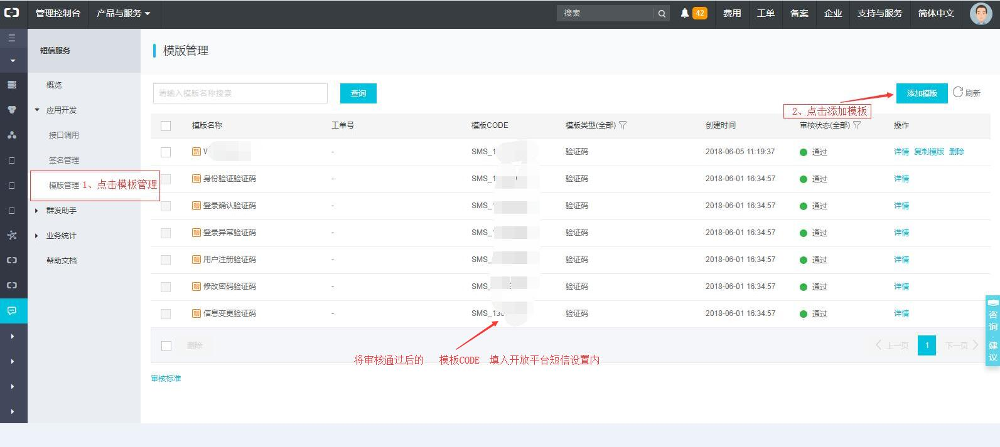

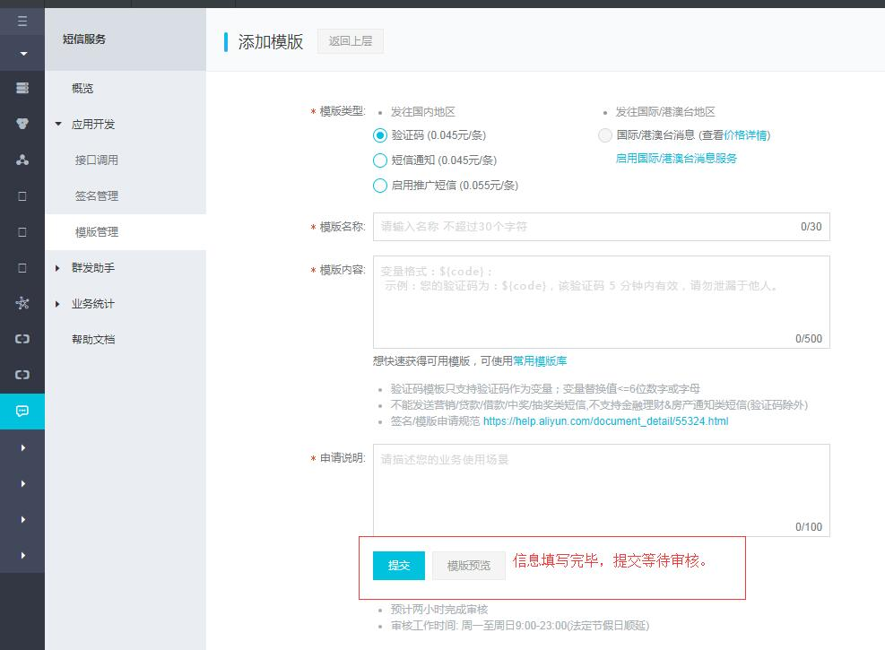

#### 腾讯云平台

#### 华为云平台

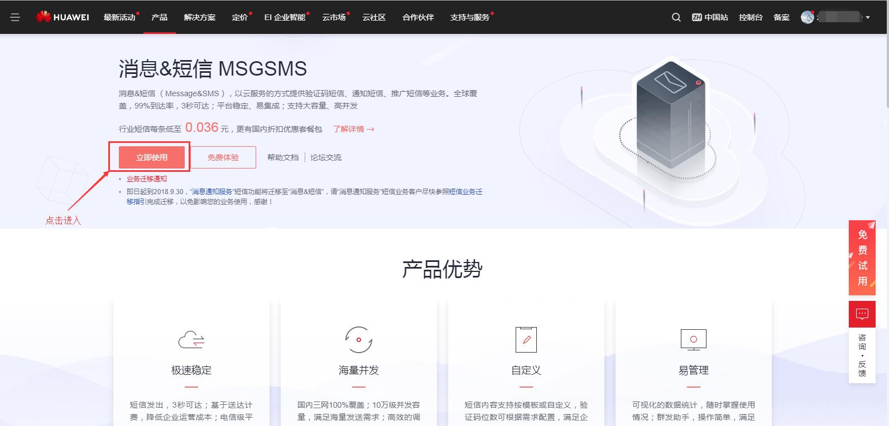

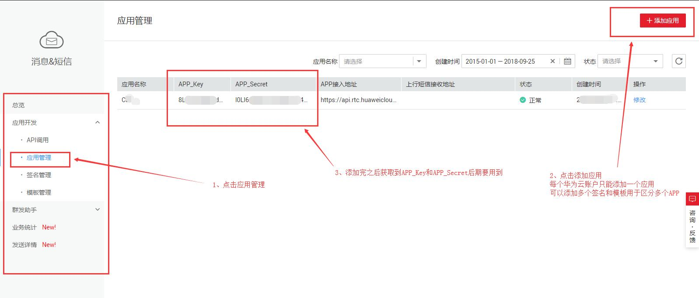

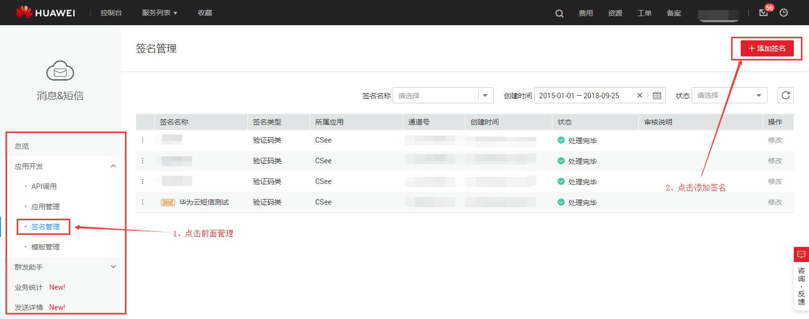

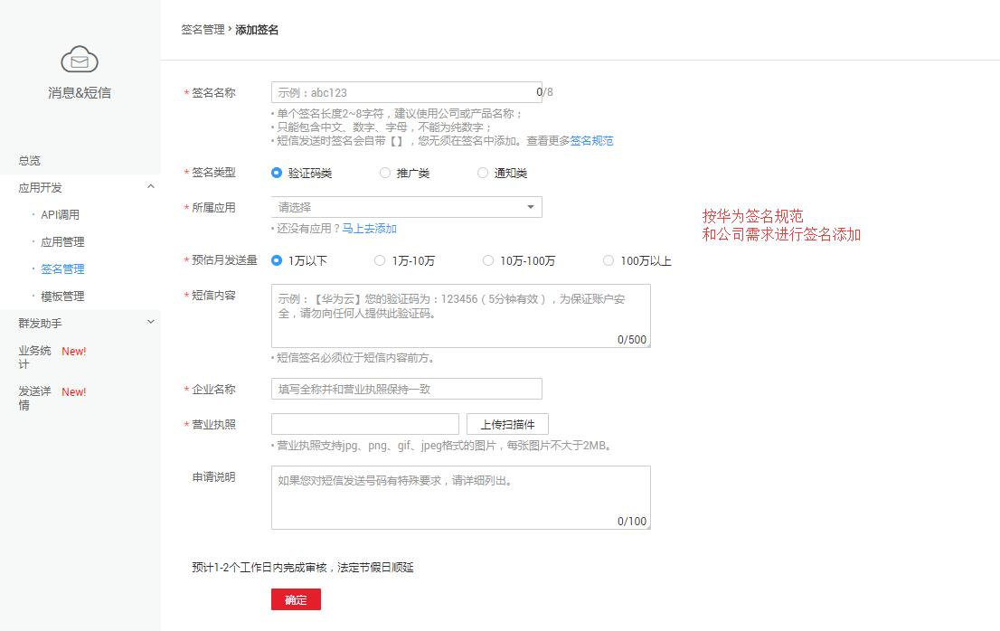

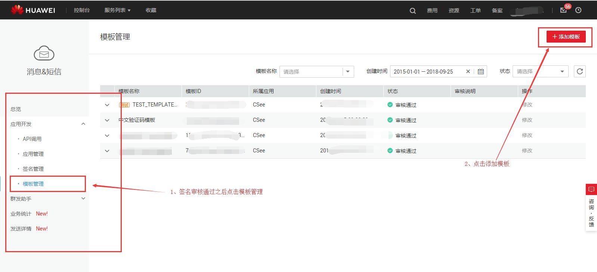

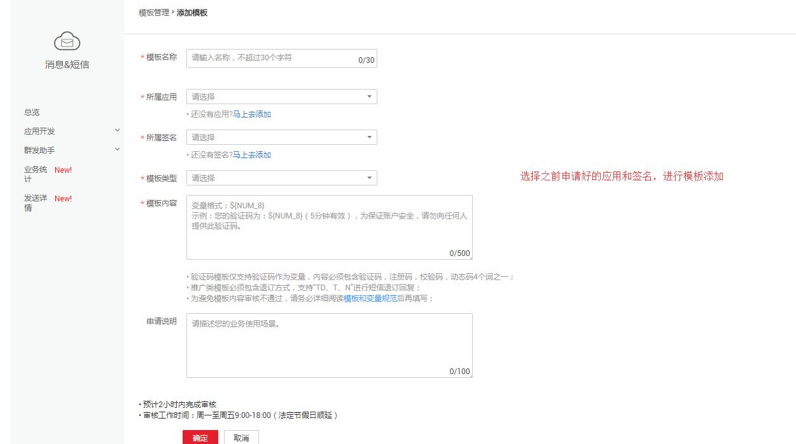

<label style="color:#c30">将获取到的1、APP_Key 2、APP_Secret  3、通道号  4、模板ID 四个值填入开放平台短信模板中，就可以使用自己的短信模板了</label>

### 短信模板上要填写的信息哪来？
答：我们目前支持
    1、[阿里云平台短信服务](https://www.aliyun.com/product/sms)

    2、[腾讯云平台短信服务](https://cloud.tencent.com/product/sms)

    3、[华为云平台短信服务](https://www.huaweicloud.com/product/msgsms.html)

    请去相对应的页面进行短信服务申请，申请成功后，将短信模板所需要的信息填入测试成功后保存即可。
    
### 测试后为什么显示有错误码？
答：如果有错误码，请去相应平台的短信发送错误码页面进行参考，可能是余额不足等其他问题。
    

    