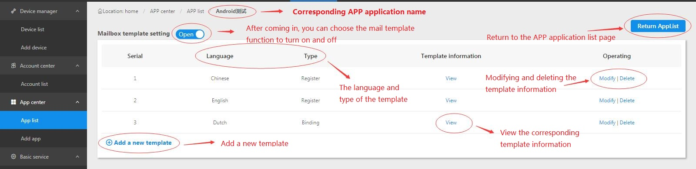
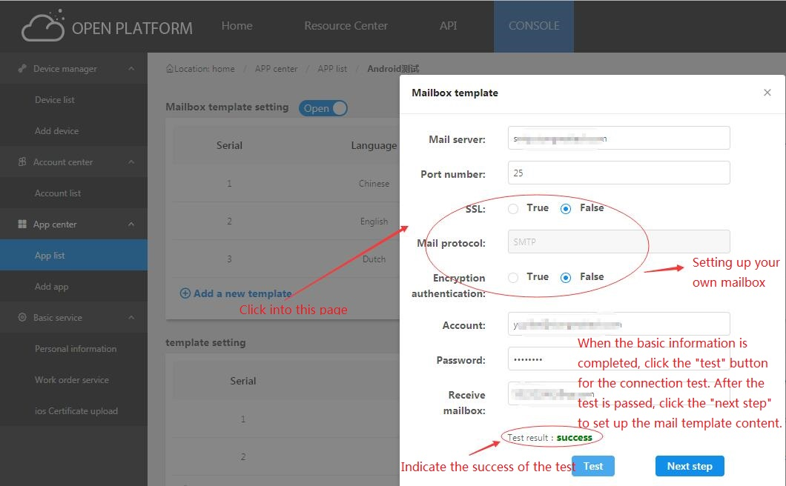
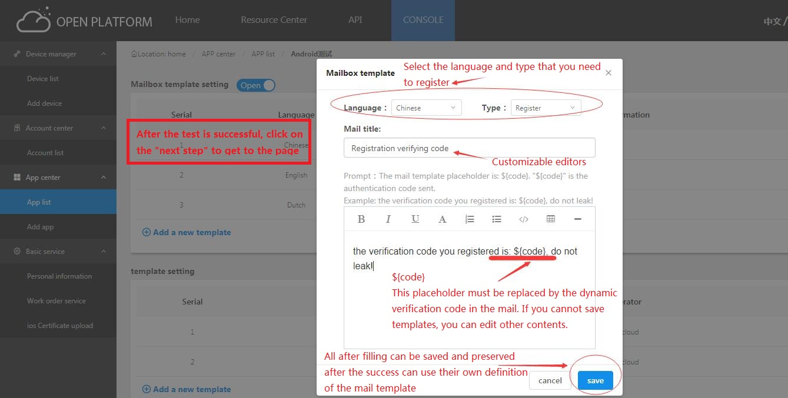

## Mail template setting steps

1、Mail template settings entry:

2、After entering the mail template page, the basic operation is:

3、The new mail template is added to be saved until the test is successful:

4、After the test is successful, enter the next step, fill in the template information.
   The placeholder "${code}" must be included:

## Mail template common problems

### Can different APP applications use different mailbox information and mail templates?
Answer：Different APP applications can use different mailbox information and mail templates.
  
   Just apply on the main page of the application list,
   click the corresponding APP application settings button,
   and enter the mail template to set up.