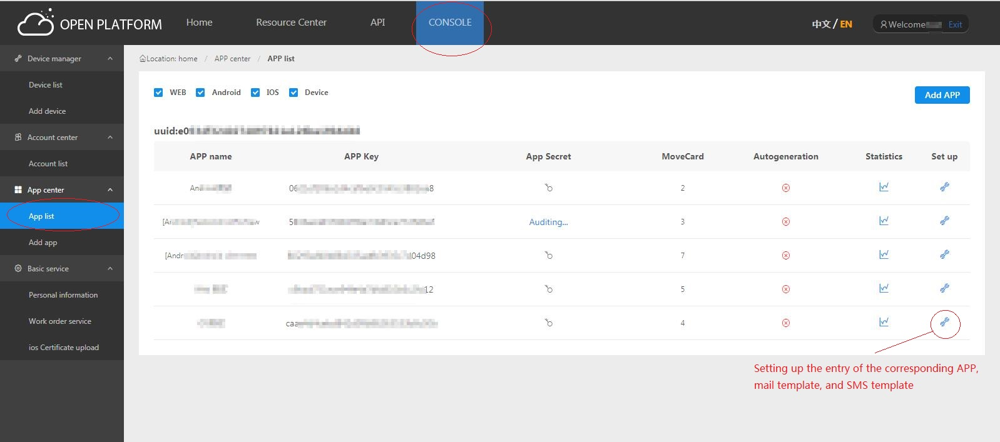
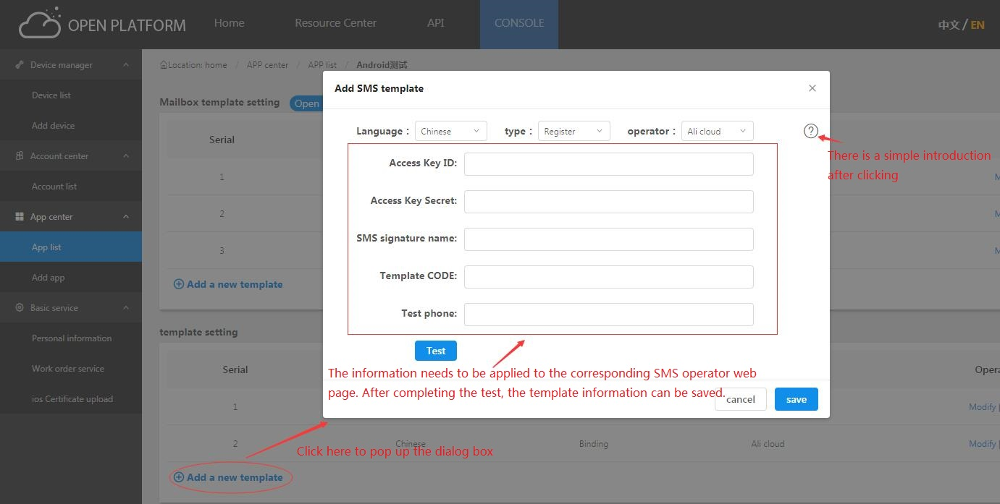

## Short message template setting steps

1、SMS template settings entry:

2、The new SMS template is added, and it needs to be tested successfully before it can be saved.

## Common problems of SMS template

### What platforms do SMS templates support?
Answer：We are now supporting[Ali cloud platform short message service](https://www.aliyun.com/product/sms)and[Tencent cloud platform short message service](https://cloud.tencent.com/product/sms)

### Where is the message to be filled on in the SMS template?
Answer：We are now supporting[Ali cloud platform short message service](https://www.aliyun.com/product/sms)and[Tencent cloud platform short message service](https://cloud.tencent.com/product/sms)，
    Please apply for the short message service on the corresponding page.
    After the application is successful, fill in the information needed by the SMS template and save it after successful.
    
### Why is there an error code after the test?
Answer：If there is an error code, please go to the corresponding platform to send the error code page for reference,
 which may be other problems such as insufficient balance.
    

    